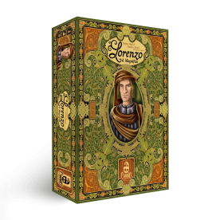
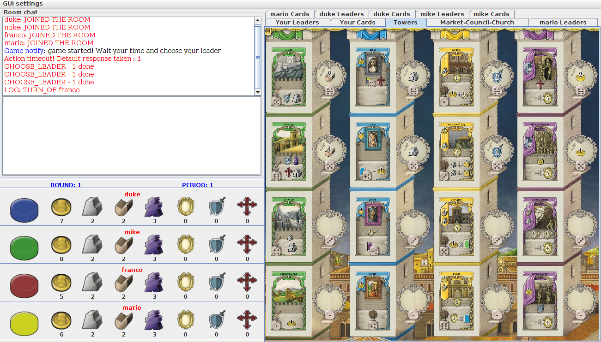

# Prova Finale - Ingegneria del Software
<div style="text-align:center"></div>


## Table of contents
* [Getting started](#getting-started)
  + [Requirements](#requirements)
  + [Dependencies](#dependencies)
  + [UML](#uml)
  + [How to start the server](#how-to-start-the-server)
  + [How to start a client](#how-to-start-a-client)
* [Implemented Features](#implemented-features)
  + [Game specific features](#game-specific-features)
    -  [5 players mode](#5-players-mode)
    -  [Persistence](#persistence)
    -  [Statistics](#statistics)
  + [Configurable variables](#configurable-variables)
  + [Connections](#connections)
  + [User interfaces](#user-interfaces)
  + [Additional features](#additional-features)
* [Application flow](#application-flow)
* [Tutorial](#tutorial)
* [Tests](#tests)
## Getting started
### Requirements
 * JAVA SE 8
 * Maven
### Dependencies
 * Jacoco Maven Plugin
 * JUnit 4.12
 * JSon 20160810

### Contributors
- Lorenzo Pratissoli
- Lorenzo Soliveri

### Uml
Uml diagram is in the folder ```/uml```
### How to start the server
The server Main class is ```/src/main/java/it/polimi/ingsw/GC_18/server/Main.java``` and takes no arguments to be run as Java Application. Only one instance is allowed.
### How to start a client
The client Main class is ```/src/main/java/it/polimi/ingsw/GC_18/client/Main.java``` and takes no arguments to be run as Java Application. A client can be instantiated multiple times on the same machine.
## Implemented features
The server and client for "Lorenzo il magnifico" are both implemented using JAVA 8 SE.
### Game specific features
The game is implemented in its advanced mode, so it includes, besides all the permanent effects, the leader cards, the excomunication tiles and the customized bonus tiles. It also extends the set of rules of the original "Lorenzo il Magnifico" by adding a [5 players mode](#5-players-mode).
### 5 Players Mode
In 5 players mode, the board is extended with a fight area. This area is a spot where players can place any number of pawns they want per round. Each round there's a fight that has a prize which consists in a number of resources equal to the sum of the military points that each player has at the end of that round. Each round changes the resources type given by the prize:

+ 1st round -> the prize is given in money
+ 2nd round -> the prize is given in servants
+ 3rd round -> the prize is given in woods
+ 4th round -> the prize is given in stones
+ 5th round -> the prize is given in faith points
+ 6th round -> the prize is given in victory points

Each players that has placed a pawn in the fight area gets a share of the prize equal to
(player battle points)/(sum of all battle points) where each player battle points are calculated like this:
player's military points + sum of the dices values of the pawns placed in the fight area this round + sum of the servants spent for the place in the fight area this round.
### Persistence
During the game the clients connected can vote for saving the game. If all clients of a game voted for saving then the game is saved as soon as the current round reaches its end (church report included). The saved game is loaded as soon as the same users join in the same room. Note: a game can be saved more than once during its course, but always at the end of a round (last one excluded).
### Statistics
The server at the end of each game saves the statistics for each player in that game. The statistics saved for each player are: the number of games played, the number of games won, the number of games lost, the sum of the victory points accumulated in the end of each game.
A client can request and visualize the statistics from the menu. If the user is using GUI the statistics are displayed in a sortable table, otherwise they are just printed in the CLI.
### Game agnostic features
### Configurable variables
+ Server configuration: Server configurable variables, such as timeout of the room before it automatically starts a game, can be found and set in the file ```/resources/properties/serverConfig.properties```
+ Client configuration: Client configurable variables, such as messages displayed in chat, can be found and set in the file ```/resources/properties/clientConfig.properties```

    Note: make sure ROOMMAXSIZE and IP's in both clientConfiguration.properties and serverConfiguration.properties are the same!

+ Game configuration: Game configurable variables, such as turns timeouts, can be found and set in the file ```/resources/properties/gameConfig.properties```
+ Board/PersonalBoard configuration:

    * Action places bonus: the resources given as bonus in the action places can be modified in the file ```/json/bonuses.json```
    * Action places value: the value needed for placing in the action places can be modified in the file ```/json/values.json```
    * Faith Track bonus: the resources given as bonus in the faith track can be modified in the file ```/json/faithTrack.json```
    * Bonus Tiles bonus: the resources given as bonus by the bonus tiles can be modified in the file ```/json/bonusAdvancedTile.json```

    It is also possible to configure:
    * Initial resources: the initial resources given to players at the start of the game can be modified in the file ```/json/initialResources.json```
    * Territory costs: the costs for picking up territories can be modified in the file ```/json/territoryCosts.json```
    * Building bonus: the resources given as bonus at the end of the game for the number of buildings picked up can be modified in the file ```/json/buildingCards.json```
    * Character bonus: the resources given as bonus at the end of the game for the number of characters picked up can be modified in the file ```/json/influencedCharactersBonus.json```
    * Territory bonus: the resources given as bonus at the end of the game for the number of territories picked up can be modified in the file ```/json/territoryCards.json```
    * Character cards: the character cards can be modified in the file ```/json/characterCards.json```
    * Building cards: the building cards can be modified in the file: ```/json/buildingCards.json```
    * Territory cards: the territory cards can be modified in the file: ```/json/territoryCards.json```
    * Venture cards: the venture cards can be modified in the file ```/json/ventureCards.json```
    * Excomunication Tiles: the excomunication tiles can be modified in the file ```/json/excomunicationTiles.json```
    * Leader cards: the leader cards can be modified in the file ```/json/leaderCards.json```

+ Cards configuration:
before reading this remember if you want to set a resource value in resources to 0 you can just avoid putting it in the json and when loaded it will be initialized to the default value of 0.
Remember also that you can find some effects in the json with a letter appended at the end. The letters can be H, E, P. H stands for harvest permanent effect, P for production permanent effect and E for endgame permanent effect.
Speaking at code level it means they are decorated.
    * Cost: every development card cost can be configured by modifying the cost object in the json
        ```
        "cost": {
            "money": x,
            "servants": x,
            "stones": x,
            "woods": x,
            "faithPoints": x,
            "militaryPoints": x,
            "victoryPoints": x
        }
        ```
        venture cards can also have an alternative costs that is configurable aswell
        ```
         "alternative": {
            "militaryPoints": x
         },
         "alternativeRequires": {
            "militaryPoints": x
         }
        ```
        where alternative indicates the cost the player has to pay and alternativeRequires the resources the player must have for paying the cost.

    * Requirements: every leader card requirement can be configured by modifying the requirement object in the json
        ```
         "requirement": {
            "buildingCards": x,
            "territoryCards": x,
            "characterCards": x,
            "ventureCards": x
            "resources": {
                "money": x,
                "servants": x,
                "stones": x,
                "faithPoints: x,
                "militaryPoints": x,
                "victoryPoints": x
            }
        ```
        where the cards are the cards the player must have in his personal board before playing the leader.
        If the requirement is of type: "the player must have a total number of x development cards" then the json is structured this way
        ```
         "requirement": {
            "any": "true",
            "anyValue": x,
            "resources": {
                 "money": x,
                 "servants": x,
                 "stones": x,
                 "faithPoints: x,
                 "militaryPoints": x,
                 "victoryPoints": x
            }
         }
        ```
    * Effects:
        * Immediate:
            * Bonus: gives a resources bonus
                 ```
                "bonus": {
                     "resources": {
                        "money": x,
                        "servants": x,
                        "stones": x,
                        "woods": x,
                        "faithPoints": x,
                        "militaryPoints": x,
                        "victoryPoints": x,
                        "councilPrivileges": x
                     }
                }

                 ```
            * BonusPerCard: gives a resources bonus per type of card
                 ```
                 "bonusPerCard": {
                        "resources": {
                          "money": x,
                          ..
                          "councilPrivileges: x
                        },
                        "card": "green"
                 }
                 ```
              the type of card is indicated by its color. green for territory, blue for character, yellow for building, purple for venture

            * ExtraFloorPick: gives the player the possibility to do an extra action in a floor

                 ```
                  "extraFloorPick": {
                        "color": "any",
                        "value": x,
                        "discount": {
                            "money": x,
                            ..
                            "victoryPoints": x
                        }
                 }
                 ```

                 the tower in which the extra place can be done is indicated in color, if the extra place can be done
                 in any type of tower then it is set to any. The starting value of the action is set in value. Extra floor picks
                 can also have a resources discount.

            * ExtraHarvest: gives the player the possibility to start an extra harvest action.
                 ```
                 "extraHarvest": {
                      "value": x,
                      "changeable": true
                 }
                 ```
                 the starting value of the action is set in value. Changeable indicates the action can be modified
                 by other card effects.

            * ExtraProduction: gives the player the possibility to start an extra production action.
                ```
                "extraProduction": {
                     "value": x,
                     "changeable": true
                }
                ```
                the starting value of the action is set in value. Changeable indicates the action can be modified
                by other card effects.

            * VictoryPerResource: gives the player a victory points for every number of resources indicated he has
                ```
                "victoryPerResource": {
                       "resources": {
                       "militaryPoints": x
                        }
                }
                ```

                in this case for every x military points the user has a victory point will be given.

        * Dynamic

            * ChurchSupportBonus: gives the player a bonus every time he supports the church.
                 ```
                "churchSupportBonus": {
                     "resources": {
                       "money": x,
                       ..
                       "councilPrivileges": x
                     }
                 }
                 ```

            * FloorChange: changes the value of tower actions and can also give a discount.
                 ```
                "floorChange": {
                     "color": "any",
                     "value": x,
                     "discount": {
                       "money": x,
                       ..
                       "victoryPoints": x
                     }
                   }
                 ```
                where color indicates the tower color.

            * FloorChangeOr: changes the value of tower actions and gives two type of discounts. The player has to choose the one he wants.
                 ```
                "floorChangeOr": {
                     "color": "any",
                     "value": x,
                     "discount1": {
                       "money": x,
                       ..
                       "victoryPoints": x
                     },
                     "discount2": {
                       "money": x,
                       ..
                       "victoryPoints": x
                     }
                   }
                 ```

            * HarvestChange: changes the value of a harvest action.
                 ```
                "harvestChange": {
                       "value": x
                     }
                 ```
            * ProductionChange: changes the value of a production action.
                 ```
                 "productionChange": {
                       "value": 2
                 }
                 ```

            * PawnValueChange: changes the value of a pawn for an action.
                 ```
                 "pawnValueChange": {
                      "colors": ["neutral", "black", "orange", "white"],
                      "value": x
                 }
                 ```
                 in colors there are all the type of pawns that will be modified by this effect.

            * ResourcesChange: modifies the resources bonus given to a player.
            Every time a player gets money it gets x less money if x is negative, else x more, for example.
                 ```
                 "resourcesChange": {
                   "resources": {
                     "money": x,
                     ..
                     "victoryPoints": x
                   },
                   "source": [
                     "immediate",
                     "permanent",
                     "actionPlace",
                     "oncePerTurn",
                     "permanentLeader",
                     "councilPrivilege"
                   ]
                 }
                 ```
                 The change will be applied only on resources coming from sources listed in source. All the possible sources are written in the example above.

            * ResourcesMultiplier: modifies the resources bonus given to a player by multiplying them.
            Every time a player gets money it gets multiplier*money money. Every resource that needs a multiplication has 1 as its value in the json.
                 ```
                 "resourcesMultiplier": {
                      "resources": {
                        "money": 1,
                        ..
                        "councilPrivileges": 1
                      },
                      "source": [
                        "immediate",
                        ..
                        "councilPrivilege"
                      ],
                      "multiplier": x
                    }
                 ```
        * EndGame

            * EndGameVictoryMalus: for every x resource the player has it subtracts the player 1 victory point.
                 ```
                 "endGameVictoryMalus": {
                     "resources": {
                       "money": x,
                       ..
                       "victoryPoints": x
                     }
                 }

                 ```

            * EndGameVictoryMalusCost: subtract Victory Points endgame for every woods and stones in player's towercolor's type of cards
                ```
                 "endGameVictoryMalusCost": {
                   "color": "any"
                 }

                 ```

        * Game
            * PawnSet: sets the value of one one or more pawn to a specified value.
                ```
              "pawnSet": {
                  "value": x,
                  "colors": ["orange", "black", "white", "neutral"]
                }
                ```
             in colors you can set the type of pawn that will be modified.

        * OncePerTurn

            * PawnSetChoose: sets the value of a pawn choose by the player.
                ```
              "pawn: SetChoose": {
                 "value": 6
              }
                ```
        * Production
            * Exchange: let the player give in resources for some other resources
              ```
              "exchangeP": {
                  "in": {
                    "money": x,
                    ..
                    "victoryPoints": x
                  },
                  "out": {
                    "money": x
                    ..
                    "victoryPoints": x
                  }
                }
                ```

            * ExchangeOr: let the player choose between two exchange options.

              ```
              "exchangeOrP": {
                 "in1": {
                   "money": x,
                   ..
                   "victoryPoints": x
                 },
                 "out1": {
                   "money": x,
                   ..
                   "victoryPoints": x
                 },
                 "in2": {
                   "money": x,
                   ..
                   "victoryPoints": x
                 },
                 "out2": {
                   "money": x,
                   ..
                   "victoryPoints": x
                 }
              }
              ```

        * Static
            * EndGameNegate: negates bonus received end game for every color type of cards the player has
              ```
              "endGameNegate": {
                 "color": "any"
              }
              ```

            * PlaceNegate: negates a place in some action places.

               ```
               "placeNegate": {
                   "places": [
                     "coinSpot",
                     "militarySpot",
                     "servantSpot",
                     "councilSpot",
                     "councilPalace",
                     "harvestArea",
                     "largeHarvestArea",
                     "productionArea",
                     "largeProductionArea",
                     "floor"
                   ]
                 }
                ```
               these places are the ones the player may not be able to place the pawn in.

            * ServantMalus: applies a servant malus on a player. The player has to spend x servants for adding 1 to the value action.
                ```
                "servantMalus": {
                    "value": x
                }
                ```

### Connections
The server and the clients support both RMI and sockets connection for exchanging information. The server listens for connections from clients and binds with them as soon as a client's request reaches it. The socket connection requires two free ports for the binding: one for the exchange of strings and the other for the exchange of Game objects. The RMI connection instead requires only a socket but the system must have previously enabled RMI connections. The ports for connection are configurable.
The user (so the client application) can choose during the login which connection interface he prefers to use, meanwhile the server application always listens for both kind of connections.
If a user disconnects during the course of a game he can then reconnect to it without loosing his turns unless the time outs expire. If a user reconnect he can change the type of connection he wants to use.
### User interfaces
The server has no interface for the user (except a log message on start done using System.out): it just runs as a daemon and does its stuff with files for saving and loading the data needed.

The client instead offers 2 user interfaces:

* command line interface (CLI), where the user can write and read the messages from System.in and System.out. The user can always type 'help' to receive information about the state of the application and the commands it expects.
* graphical user interface (GUI), where the user can see and interact with the application through a window. While using GUI the CLI is also enabled.

The user can choose during the login which interface he prefers, but he can always switch interface at run time by typing to System.in 'set_user_interface'.
### Additional features
* **CHAT**: The application includes a chat that supports basic HTML to let users chat between them during the course of the game and while in room.
* **Music Theme**: The client application also offers the possibility to the user to toggle the music. The theme depends on the state of the application.
## Application flow
+ **SERVER FLOW**:

	The server application starts, loads its configurable properties from file and sets up its listeners for incoming connections. For each connection established it expects a user name and a password that identify the user. If a client with that user name already exists it checks that the password matches the stored one and the login is successful, else the login is invalid. After a valid login the user can request the statistics or find a game. The game search is done using rooms: if there's already an existing room with space then the client joins it else a new room is created. The room enables the client to chat between them before a game starts, but also during the game itself. The game starting is regulated by a timeout that triggers as soon as two clients join the same room (if one of the two client leaves earlier the time out is reset). If the timer goes off or if the room reaches the maximum number of players then the game starts. The room and the clients are then set in game state, so if they disconnect they can reconnect and rejoin the game. Then the game proceeds and in the end the server notifies the clients of the winner and then destroys the room.
+ **CLIENT FLOW**:

	The client applications starts, loads its configurable properties from file and in parallel prompts the login screen to the user and loads the images and musics assets needed. The login credentials decides the type of connection and user interface to use. Using the selected type of connection the application connects to server and sends the credentials that if valid allows the user to enter the menu, otherwise the user must repeat the process of login. From the menu the user can decide to find a game or to view the statistics. If the player decides to find a game he enters the room screen that will show the users he is in room with and a chat. On the command of game began received from the server, the application enters the game state and lets the user play. If the user closes the application while in game, he can then reconnect to the running game that proceeded even without him (the user doesn't lose his turns unless his turn timer on the server expires so that the game can be more fair towards people with connection problems). When the game ends or when the game is saved the user can return to the menu to restart the process. In every moment the user can exit the application, enable or disable the music (music is not enabled if using CLI) and change the user interface he is using.
## Tutorial
+ CLI: you just need to follow the instructions that will be printed. If you need help just type help in the terminal. Every command for using the cli is case insensitive.
Regarding the choose command: every time the game asks you to choose between some options you have to send the command choose with the option you choose.
There are different type of commands with options the game can ask you.
    * CHOOSE_LEADER: you need to answer with the number of the leader you want to choose. Example ```choose - 2```
    * ASK_ACTIVATION: you need to answer with yes or no. Example you can send ```choose - yes```
    * ASK_SUPPORT: you need to answer with yes or no. Example you can send ```choose - no```
    * COUNCIL_PRIVILEGES: you need to answer with the type of resources you want from the council. Example ```choose - 1```
    * EXCHANGE_OR: you need to answer with the type of exchange you want to do. Example ```choose - 2```
    * EXTRA_ANY, EXTRA_TERRITORY, EXTRA_BUILDING, EXTRA_CHARACTER, EXTRA_VENTURE: you need to answer with the floor you want to do the extra action in and the servants you want to spend. Example ```choose - building1 - 2```
    * EXTRA_HARVEST, EXTRA_PRODUCTION: you need to answer with the number of servants you want to spend for the extra harvest. Example ```choose - 2```
    * FLOORCHANGE_OR: you need to answer with the type of discount you want to apply. Example ```choose - 1```
    * LEADER_COPY: you need to answer with the number of the leader you want to copy. Example ```choose - 3```
    * PAWN_CHOOSE: you need to answer with the type of pawn you want to set the value for. Example ```choose - black```
    * VENTURE_COST: you need to answer with the type of cost you want to spend. Example ```choose - alternative```

+ GUI: you can click on action places for doing your action and placing your pawn. You can activate or discard a leader by left clicking on it.
After a leader has been activated you can left click on it for activating its once per turn effect.
You can pass by clicking on the pass button and vote for save by clicking on the save button.
The GUI is organized in tabs from where you can see the board status and the players' status.
You can zoom in development cards by left clicking on them (both in floors and in personal boards).
You can zoom in leader cards by right clicking on them.

## Tests
Besides model tests an other test has been implemented: this test mocks the server and the clients and checks that the commands received from the server are equal to the commands that the server expects to receive while simulating a full 2 player game. The mocking takes approximately 5 minutes to complete and it can use GUI components. The result of this is that the progress of test is visible and can be supervised during the mocking process.
